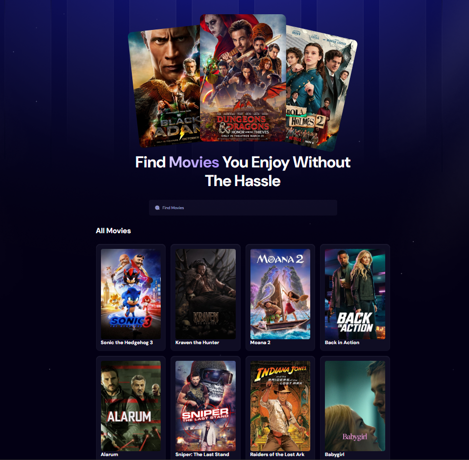
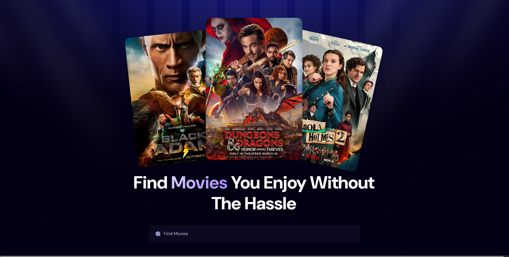
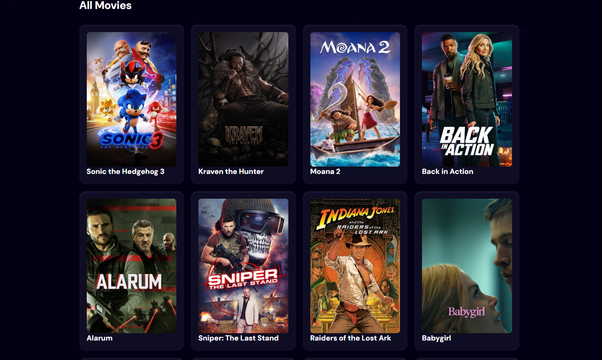

# **Page Movie**

 

> Um aplicativo web desenvolvido com React e Tailwind CSS que consome uma API de filmes para exibir informações detalhadas sobre filmes populares, lançamentos e muito mais.







## **Visão Geral**

O **Page Movie** é um projeto criado para demonstrar como consumir dados de uma API de filmes e apresentá-los de forma visualmente atraente e responsiva. O objetivo principal é fornecer uma interface amigável para os usuários explorarem informações sobre filmes, como sinopses, elenco, avaliações e trailers.

---

## **Recursos Principais**

- **Exibição de Filmes Populares**: Lista os filmes mais populares da API.
- **Detalhes do Filme**: Clique em um filme para ver informações detalhadas, como sinopse, elenco e classificação.
- **Design Responsivo**: Interface adaptável para dispositivos móveis, tablets e desktops.
- **Filtragem e Pesquisa**: Encontre filmes específicos usando a barra de pesquisa.
- **Estilização Moderna**: Design limpo e moderno utilizando **Tailwind CSS**.

---

## **Tecnologias Utilizadas**

- **React**: Framework JavaScript para construção da interface do usuário.
- **Tailwind CSS**: Framework de estilização utilitária para design responsivo.
- **Axios**: Biblioteca para realizar requisições HTTP à API de filmes.
- **API de Filmes**: Fonte de dados para informações sobre filmes (verifique a documentação da API para obter mais detalhes).

---

## **Instalação e Configuração Local**

Siga as instruções abaixo para configurar o projeto em sua máquina local:

### **Pré-requisitos**

- Node.js (versão 16 ou superior)
- npm ou yarn instalado

### **Passos para Instalação**

1. Clone o repositório:
   ```bash
   git clone https://github.com/Guisandroni/Page-Movie.git
   ```

2. Navegue até o diretório do projeto:
   ```bash
   cd Page-Movie
   ```

3. Instale as dependências:
   ```bash
   npm install
   ```
   ou
   ```bash
   yarn install
   ```

4. Configure a API Key:
   - Crie um arquivo `.env` na raiz do projeto.
   - Adicione sua chave de API no formato abaixo:
     ```
     REACT_APP_API_KEY=SUA_CHAVE_DE_API_AQUI
     ```

5. Inicie o servidor de desenvolvimento:
   ```bash
   npm start
   ```
   ou
   ```bash
   yarn start
   ```

6. Acesse o aplicativo no navegador:
   ```
   http://localhost:3000
   ```

---

## **Estrutura do Projeto**

```
Page-Movie/
├── public/               # Arquivos públicos (ícones, imagens, etc.)
├── src/
│   ├── components/       # Componentes reutilizáveis
│   ├── pages/            # Páginas principais da aplicação
│   ├── services/         # Funções para requisições à API
│   ├── App.js            # Componente principal da aplicação
│   ├── index.js          # Ponto de entrada da aplicação
│   └── tailwind.config.js # Configuração do Tailwind CSS
├── .env                  # Variáveis de ambiente
├── package.json          # Dependências e scripts do projeto
└── README.md             # Documentação do projeto
```

---

## **Contribuição**

Contribuições são bem-vindas! Se você deseja contribuir para este projeto, siga os passos abaixo:

1. Faça um fork do repositório.
2. Crie uma branch para sua feature:
   ```bash
   git checkout -b feature/nome-da-feature
   ```
3. Faça commit das suas alterações:
   ```bash
   git commit -m "Adiciona nova feature"
   ```
4. Envie suas alterações para o repositório remoto:
   ```bash
   git push origin feature/nome-da-feature
   ```
5. Abra um Pull Request no GitHub.

---

## **Licença**

Este projeto está licenciado sob a **MIT License**. Consulte o arquivo [LICENSE](LICENSE) para mais detalhes.

---

## **Autor**

Desenvolvido por **Guilherme Sandroni**.

- GitHub: [@Guisandroni](https://github.com/Guisandroni)
- LinkedIn: [Guilherme Sandroni](https://www.linkedin.com/in/guilherme-sandroni/)